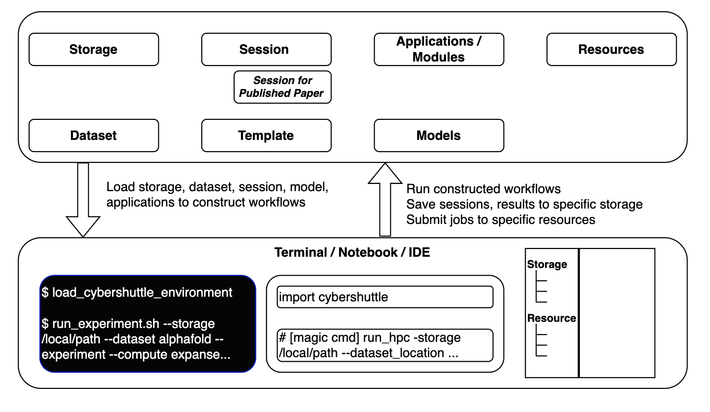

# Table of Contents

1.  [Cybershuttle overall Ux](#org1d49dd8):ATTACH:
2.  [Cybershuttle - Modules and their requirements](#org53e962b)
    1.  [Storage](#org7f005eb)
        1.  [Requirement of an storage instance](#orgb765903)
        2.  [Functionalities](#org56f6bb8)
        3.  [Example use-cases](#org8230eb1)
    2.  [Dataset [Advanced feature]](#org24597f4)
        1.  [Requirement for a dataset](#org0c0a30e)
        2.  [Functionalities](#orgbf6101d)
        3.  [Example use-cases](#org96e43e1)
    3.  [Compute Resources](#org5a879b4)
        1.  [Requirement of an compute resource instance](#org2ad2ff4)
        2.  [Functionalities](#orgbdc3ea2)
        3.  [Registering compute resource &#x2014; Only through a web interface.](#org9a51fb4)
        4.  [Example use-cases](#orgc6ef905)
    4.  [Sessions](#org8adb5ef)
        1.  [Requirement for a session](#orgd346b7a)
        2.  [Functionalities](#org0d55a33)
        3.  [Example use-cases](#org6444c97)
        4.  [Related works](#orgc1ae5b4)
    5.  [Template [Extention of a session][Advanced feature]](#orgf4a1cff)
        1.  [Requirement for a recipe / template](#org7025423)
        2.  [Functionalities](#org6d7056e)
        3.  [Example use-cases](#orgd390fb8)
    6.  [Application / Modules](#orgc4449b3)
        1.  [Functionalities](#org3b9f06e)
        2.  [Example use-cases](#org198c5e5)
    7.  [Models [Advanced feature]](#org4f1429d)
        1.  [Functionalities](#org74d714e)
        2.  [Example use-cases](#org3688a5d)
3.  [Related works](#orge2440c6)

# Cybershuttle overall Ux     :ATTACH:

# Cybershuttle - Modules and their requirements

## Storage

This module provides filesystem level access to specific folders which could be distributed across resources through an unified library.

### Requirement of an storage instance

-   Read or write file system level access at a data storage.
-   If remote, requires specific accessing mechanism (eg. sftp will need ssh keys)
-   Permission of cybershuttle to operate on the end-point

### Functionalities

-   Register new storage - to include:
    -   [ ] Local
    -   [ ] Campuss
    -   [ ] Google drive, onedrive etc..
    -   [ ] Paths in HPC

-   Each user will have their specific storage profile. This could include their local and remote access locations.

-   Access storage using their name without expanding accessing mechanism (eg. access remote storage by name and not through sftp etc.).

-   Linked storage can be used for reading or writing.

### Example use-cases

In user local machine

    cybershuttle storage initialize <user>
    
    # Register new path 
    cybershuttle storage register --location /local/path --name lab_storage 
    cybershuttle storage register --location ftp:/remote/path --name hpc

In remote machine

    
    cybershuttle storage initialize <user>
    
    # Load storage to current session 
    cybershuttle storage mount lab_storage ./
    ls lab_storage
    
    # List all availabe storage
    cybershuttle storage ls 

## Dataset [Advanced feature]

This module allows to register and use datasets without specifying the storage. *Cybershuttle will find the optimal end point for the dataset and can be transparent to the user.* 

### Requirement for a dataset

-   Dataset could be a path from storage or accessible through an API.
-   Dataset are accessed only through read-only mode.

### Functionalities

-   Allow for public or private datasets.
-   Register new dataset from storage or from web link.
-   Private datasets are used per-user.
-   Allow pass through for other API or dataset access
-   [Optional] Register fields in dataset.
-   [Optional] Provide mechanism for API access for the dataset.

### Example use-cases

    cybershuttle dataset initialize <user>
    
    # Register new dataset 
    cybershuttle dataset register --location /local/path --name personal_dataset 
    cybershuttle dataset register --location https://www.cs.toronto.edu/~kriz/cifar-10-python.tar.gz --name cifar10 --after_download_command 'tar -z'
    
    # Load 
    cybershuttle dataset load personal_dataset 

## Compute Resources

This module provides access to various computing resources through an unified library. This will streamline all the security and accessing mechanism into a single abstraction. 

### Requirement of an compute resource instance

-   Able to access computing through any of the following mechanisms:
    -   run directly as shell commands
    -   submit jobs via slurm
-   Each user will have their specific resource profile.
-   Provide mechanism for linux level job monitoring or slurm job monitoring
-   Provide way to monitor usage

### Functionalities

-   Register new compute resource - to include:
    -   [ ] Local workstations &#x2013; for direct shell job submissions
    -   [ ] Campus resources &#x2013; this could be just another slurm access
    -   [ ] HPC access

### Registering compute resource &#x2014; Only through a web interface.

TODO: CI people should elaborate on this process.

### Example use-cases

    cybershuttle compute initialize <user>
    
    # list currently available computing resources
    cybershuttle compute list
    
    # execute command on different resources
    cybershuttle compute execute 'run_model_1st_stage.sh' --resource local  --resources CPU 
    cybershuttle compute execute 'run_model_2nd_stage.sh' --resource hpc  --resources GPU
    
    # reading from yml file for additional dependencies
    cybershuttle compute execute 'run_model_1st_stage.sh' --resource local  --resources CPU --setup_file cybershuttle_resource.yml

In Jupyter &#x2013; Current setup

    import airavata_jupyter_magic
     
    %authenticate
    %request_runtime hpc_cpu --file=cybershuttle.yml --walltime=60 --use=NeuroData25VC1:cloud
    %wait_for_runtime hpc_cpu --live
    %switch_runtime hpc_cpu

## Sessions

This module maintains sessions which is state of jupyter notebook or history in command line. The main use for this module is for allowing users to enable multiple work at different end-points. 
[Advanced feature] : Able to save and load the notebook state back to session. 

### Requirement for a session

-   Session is a single instance of a particular computational workflow.
-   Session could involve multiple storage, resources etc.
-   Allows for flexible setup of cybershuttle environment (storage, resources etc.) for specific user-defined steps.
-   [Optional] Restrict only one notebook is allowed per session.

### Functionalities

The main functionality is for saving and load history of actions.

-   Session could be one of the following:
    -   Open notebook (or set of open notebooks) with its changes
    -   History of commands in command line
-   Saved sessions can be reloaded which will reflect their changes.

### Example use-cases

    cybershuttle session initialize <user>
    
    # list past sessions
    cybershuttle session list
    
    # start session
    cybershuttle session start session1
    # all commands following this will be saved within session1
    
    # user commands - including other cybershuttle 
    ...

    # load past sessions
    cybershuttle session load session1
    # this will execute the commands from last session in the exact order it was ran after the start command

As a python file

In $cybershuttle_iniitalize.py$ file 

    import cybershuttle
    cybershuttle.session.start(name='session1')
    
    cybershuttle.storage ...
    cybershuttle.resource ...

Sessions from web interface

&#x2013; This will be similar to current session implimentation in cybershuttle.

### Related works

-   ink and switch - Patchwork

## Template [Extention of a session][Advanced feature]

This module allows to convert a session as a template. This is aimed for following specific use-cases such as: parameter tuning, re-run previous work with small modifications.   

### Requirement for a recipe / template

-   Template is a session.
-   Template requires some user input for some sections.
-   [Optional] Some sections of the template could be pre-run.

### Functionalities

-   Session could be converted to template with some optional input region specified. Such inputs are provided through a file (eg. as a toml or yml file).
-   [Optional] Template has read-only and editable sections. Editable section allow for new user to run experiments for new conditions.

### Example use-cases

For parameter variations

    cybershuttle session initialize <user>
    cybershuttle template initialize <user>
    
    # add a template from a session
    cybershuttle template add --name param_tune --session session1 --input_file_format input_specs.toml
    
    # running from a template
    cybershuttle template run --name param_tune --input_file input1.yml

## Application / Modules

This module aims to provide some of the commonly used applications (eg. Psi4, NAMD, Sparc, matlab etc.), libraries (eg. pytorch) through an unified service. 
Much of this functionality should be present in other softwares including: module, conda etc&#x2026; *This is just a wrapper around these existing function, so user can view them in one place in cybershuttle.*

[Optional] Going to through cybershuttle could allow for identifying conflicts and optimizations. 
[Optional] In addition, users could register their executable as application under specific restrictions. 

### Functionalities

-   Provide an broad overview of all the available commonly used modules, applications in one place.
-   Provide an searchable interface with additional details on each of the modules/applications.
-   Able to quickly add these modules/applications to cybershuttle configuration (eg. cybershuttle.yml) file as dependencies.
-   [Optional] Identify conflicts between modules/applications.
-   [Optional] provide additional optimization for specific modules and applications.
-   [Optional] Allow users to add their executable as a module or application.

### Example use-cases

Main use for this for the users to view all the avaialble applications and modules from one place, such as a web interface. 

    cybershuttle application list
    
    
    # Load specific application
    cybershuttle application load psi4
    
    
    #wrapper for module or conda or uv etc..
    cybershuttle module list
    cybershuttle module load

## Models [Advanced feature]

This module provides specific AI or computational models in two modes: 1) inference or call without modification mode, 2) load model for modification. 

### Functionalities

AI models:

-   Load models in inference mode: this does not allow for acces to the model, but only serves as an function which takes the input (in batchs) and returns outputs.
-   Load models for modification (eg. fine-tuning): This will load the entire model to memory (when memory allows). eg. loading trained ViT pytorch model from huggingface.
-   Allow users to register their model and keep it private or shared.
-   [Optional] Inference mode models could be optimized or ran through a persistent service.

Computational models:

-   Load model for evaluation mode: similar to inference mode in AI model, this does not provide any changes to the model, but serves as an function which takes the input and returns outputs.
-   Load model for modification: this will load the computational model as a session, which will contain the required code along with all the dependencies to run the model.
-   Allow users to register their model and keep it private or shared.

AI4Science (Computational + AI) models:

-   Load AI4science models (eg. openfold), which is a collection of computational + AI models.
-   In inference mode: will be a template (derived from a session), allowing to call the entire workflow to run the
-   In modification mode: this will be a session with both the AI and computational model code and their dependencies loaded within the session.

### Example use-cases

    cybershuttle model initialize <user>
    
    #list currently available model - include public, shared and private 
    cybershuttle model list
    
    # example for running a AI model for inference
    cybershuttle model run resnet --mode inference --input_folder image_folder
    
    # load ai4sciecne model only for inference --
    cybershuttle model run openfold --mode inference --input_sequence seq1.fasta
    
    
    # load ai4science model 
    cybershuttle model load openfold --mode modify
    # this will load a session with the openfold

# Related works

papermill - <https://github.com/nteract/papermill>

